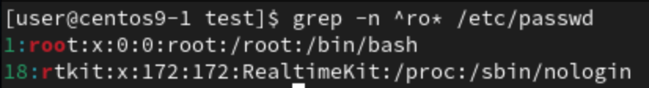
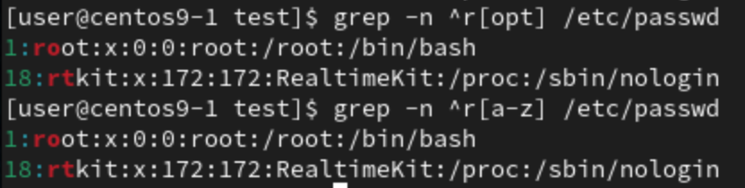
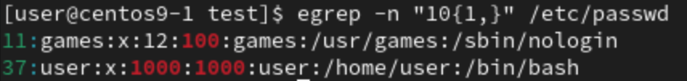
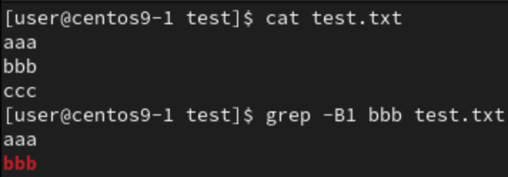
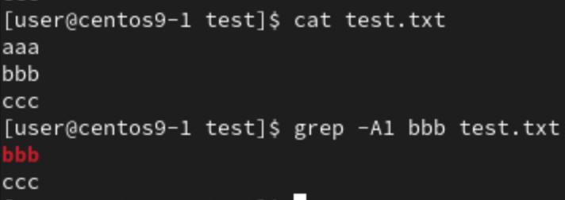
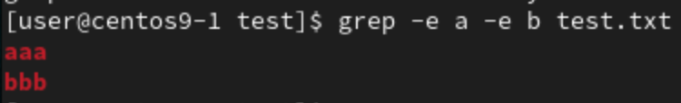
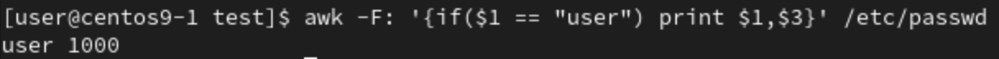
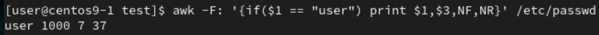

# **通配符(wildcard characters)**
- 用來匹配檔案名稱
- `?`
    - 匹配單個任意字符
```
[user@centos9-1 test]$ ls
a  a1  a11  a12  a2  a24  a3  a33  a4  aa  ab  aBZ  ac  aCD  bb
[user@centos9-1 test]$ ls a?
a1  a2  a3  a4  aa  ab  ac
```
- `*`
    - 匹配任意長度（0～多個）的任意字符
```
[user@centos9-1 test]$ ls
a  a1  a11  a12  a2  a24  a3  a33  a4  aa  ab  aBZ  ac  aCD  bb
[user@centos9-1 test]$ ls a*
a  a1  a11  a12  a2  a24  a3  a33  a4  aa  ab  aBZ  ac  aCD
```
- `[]`
    - 匹配一個單字符範圍，0~9,a-z,...
```
[user@centos9-1 test]$ ls
a  a1  a11  a12  a2  a24  a3  a33  a4  aa  ab  aBZ  ac  aCD  bb
[user@centos9-1 test]$ ls a[0-9]
a1  a2  a3  a4
[user@centos9-1 test]$ ls a[0-9][0-9]
a11  a12  a24  a33
[user@centos9-1 test]$ ls a[^0-9]
aa  ab  ac
[user@centos9-1 test]$ ls a[[:upper:]][[:upper:]]
aBZ  aCD
```

# **正則表達式(Regular Expression)**
```
grep ^root /etc/passwd
```
- Match every line start with `root` in `/etc/passwd`
- `^` : Start with 
```
grep nologin$ /etc/passwd
```
- Match every line end with `nologin` in `/etc/passwd`
- `$` : End with
```
grep ^r. /etc/passwd
```
- Match every line start with `r` with 1 any single character in `/etc/passwd`
- `.` : any single character
```
grep ^r.* /etc/passwd
```
- Match every line start with `r` in `/etc/passwd`
- `.*` : any lines
- `*` : Any length(0~n) of infront's character

```
egrep ^ro+ /etc/passwd
```
- Match any lines start with `r` and at least 1 `o` to many `o` in `/etc/passwd`
- `+` : repeat of the characters infront of it, at least 1 times to many times
```
egrep ^ro? /etc/passwd
```
- Match any lines start with `r` and 0 or 1 `o` in `/etc/passwd`
- `?` : repeat 0 or 1 times of infront character
```
grep ^r[opt] /etc/passwd
```
- Match any line start with `r` and (`o` or `p` or `t`) in `/etc/passwd`
- `[]` : any single character in `[]`
    - `r[opt]`Same as `"r[o|p|t]"`,`"ro|rp|rt"`

```
egrep -n "10{1,}" /etc/passwd
grep -n "10\{1,\}" /etc/passwd
```
- Match the lines with `10`,`100`,`1000`,...,`100000000000`,... in `/etc/passwd`
- `{1,}` : repeat the character infront at least 1 times to many times
    - `10{1,}` : repeat `0` at least ` times to many times
    - `{87}` : repeat 87 times

```
grep ^[^a-z] /etc/passwd
```
- Match any line start with **number** in `/etc/passwd`
- `[^a-z]` : Except characters a to z
- `^[^a-z]` : Start with `[^a-z]`, equal to numbers

# **grep**
```
grep [option] pattern file
```
- option
    - `-n` : show rows
    - `-i` : ignore case sensitive
    - `-v` : reverse selection
```
grep -n root /etc/passwd
```
- Match the line containing `root` in the file `/etc/passwd` with row's number
- `-n` : Show which row(s)
```
grep -B1 b test
```
- Match `b` in file `test` and show the line before matched line
- `-B1` : show the before 1 line of matched line

```
grep -A1 b test
```
- Match `b` in file `test` and show the next line of matched line
- `-A1` : show the after 1 line of matched line

```
grep -e a -e b test.txt
```
- Match `a` and `b` in file `test.txt`
- `-e` : for multiple match


# **awk**
```
awk -F: '{print $1}'
```
- Print the first column, use `:` to seperate column
```
awk -F: '{print $1,$3,$5}' /etc/passwd
```
- Print the 1,3,5 column of file `/etc/passwd`, use `:` to seperate column
```
awk -F: '{if($1 == "user") print $1,$3}' /etc/passwd
```
- Show the 1,3 column of file `/etc/passwd` if the first column is `user`

```
awk -F: '{if($1 == "user") print $1,$3,NF,NR}' /etc/passwd
```
- Show 1,3 column and NF,NR of file `/etc/passwd` if the first column is `user`
- `NF` : Number of fields
- `NR` : Number of rows

#  **ubuntu**
[IBM free cloud linux](https://linuxone.cloud.marist.edu/#/login)
## **Install apache(http)**
1. Update and install 
```
sudo apt update
sudo apt install -y apache2
```
2. Allow input from outside
```
iptables -P INPUT ACCEPT
```