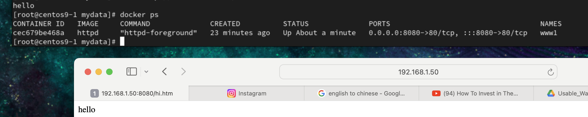
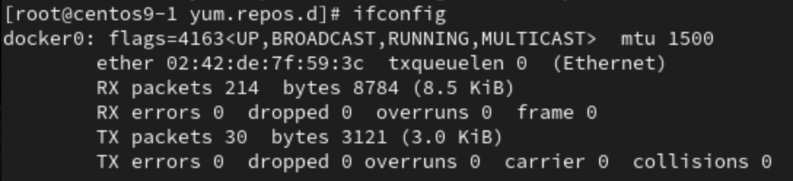
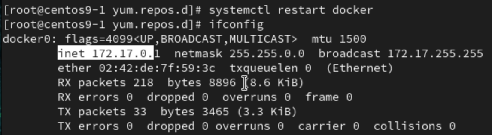
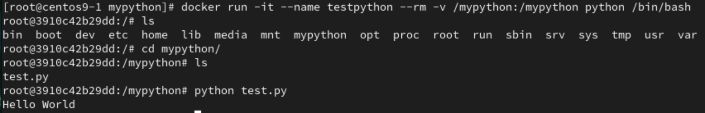
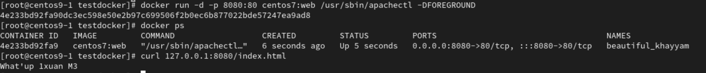
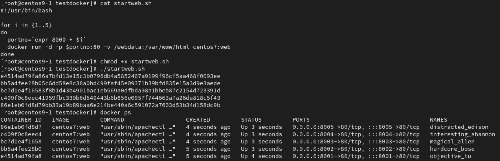

# **Docker link host folder**
1. pull httpd image 
```
sudo docker pull httpd
```
2. set host `8080` port to docker `80` port, link `/mydata`(host) to `/usr/local/apache2/htdocs/`(docker)
```
docker run -dit --name www1 -p 8080:80 -v /mydata:/usr/local/apache2/htdocs/ httpd
```
3. check ip address and done!
```
http://ip_address:8080/hi.htm
```

## **Error**
1. `docker0` have no ip address
- 
- `systemctl restart docker`
- 
# **Python with docker**
1. Install python image
```
docker pull python
```
2. create a python file `test.py` in folder `mypython`
```
mkdir /mypython
vim test.py
```
3. Link host's folder (mypython) with docker and run python image
```
docker run -it --name testpython --rm -v /mypython:/mypython python /bin/bash
```
4. Go into mypython and test python file!


# **Docker image with Dockerfile**
- default configuration file's name `Dockerfile`

1. **Dockerfile**
```
FROM centos:centos7
RUN yum -y install httpd
EXPOSE 80
ADD index.html /var/www/html
CMD ["usr/sbin/apachectl","-DFOREGROUND"]
```
2. Create a `index.html`, and add some content to it
```
vim index.html
```
3. Build docker image
```
docker build -t centos7:web .
```
4. Run docker image
```
docker run -d -p 8088:80 --name web1 centos7:web /usr/sbin/apachectl -DFOREGROUND /bin/bash

docker run -it -p 8088:80 --name web2 centos7:web /bin/bash

docker run -d -p 8080:80 centos7:web /usr/sbin/apachectl -DFOREGROUND
```
- use first to run if no `CMD ["usr...tl", "-DF...D"]` at first step

5. Done


# **Shell script with docker**
1. **Dockerfile**
```
FROM centos:centos7
RUN yum -y install httpd
EXPOSE 80
ADD index.html /var/www/html
CMD ["usr/sbin/apachectl","-DFOREGROUND"]
```
2. Create a `index.html`, and add some content to it
```
vim index.html
```
3. Build docker image
```
docker build -t centos7:web .
```
4. Shell script to run multiple images, `vim startweb.sh`
```
#!/usr/bin/bash

for i in {1..5}
do
  portno=`expr 8000 + $i`
  docker run -d -p $portno:80 -v /webdata:/var/www/html centos7:web
done
```
5. give executable permission to `startweb.sh`, and run `startweb.sh`
```
chmod +x startweb.sh
./startweb.sh
```
6. Done

