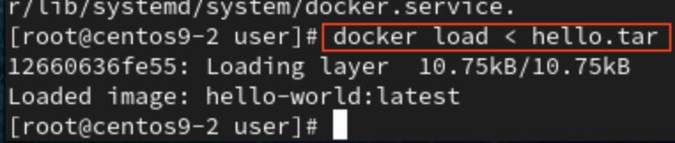
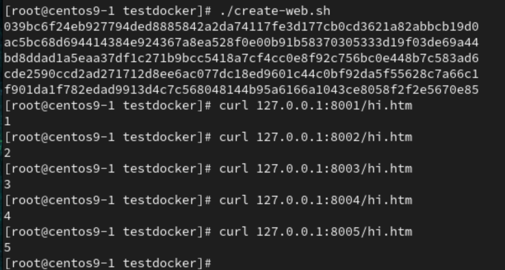
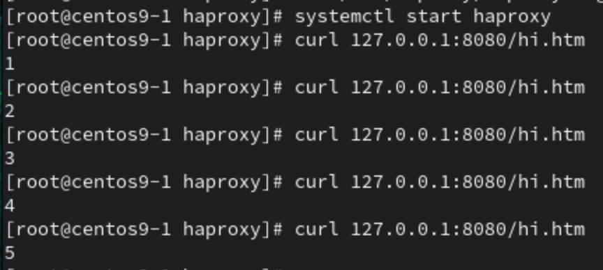

# **Docker Backup**
- Need 2 VM, (VM-a,VM-b)
1. Pack docker image to `.tar` file, At VM-a
```
docker save hello-world > hello.tar
```
2. Copy `.tar` file to VM-b
```
scp hello.tar user@ip_address
```
3. Load `.tar` , at VM-b
```
docker load < hello.tar
```
4. Done


# **Backup on Dockerhub**
1. Pull any image for testing
```
docker pull busybox
```
2. Run image
```
docker run -it --rm --name test1 busybox /bin/sh
```
3. Make some changes
```
touch 1 xuan
```
4. Commit container to image,`tag` for alias name
```
docker commit container_name username/image_name:version

docker commit test1 xiang0470/mybusybox:0.1xuan
```
5. Login to docker 
```
docker login
```
6. Push your image to dockerhub
```
docker push xiang0470/mybusybox:0.1xuan
```
7. Done


# **Load Balancer**
- 畫圖
1. Dockerfile
```
FROM centos:centos7
RUN yum -y install httpd
EXPOSE 80
```
2. Build docker image with above `Dockerfile`
```
docker build -t centos7:web .
```
3. Create a file `create_web.sh` and insert second code
```
vim create_web.sh
```
```
for i in {1..5}
do
    mkdir -p /web$i
    echo $i > /web$i/hi.htm
    portno=`expr 8000 + $i`
    docker run -d -p $portno:80 -v /web$i:/var/www/html centos7:web /usr/sbin/apachectl -DFOREGROUND
done
```
4. Give `create_web.sh` executable permission, and execute it
```
chmod +x create_web.sh 
./create_web.sh 
```

## **Haproxy on linux**
5. 
```
yum install -y haproxy
```
6. 
```
vim /etc/haproxy/haproxy.cfg

frontend http_front
    bind 0.0.0.0:8080
    default_backend myservers

backend myservers
    balance roundrobin
    server server1 127.0.0.1:8001
    server server2 127.0.0.1:8002
    server server3 127.0.0.1:8003
    server server4 127.0.0.1:8004
    server server5 127.0.0.1:8005
```
7. 
```
systemctl start haproxy
```
8. Done


## **Haproxy on docker**
- Check host ip, configuration backend server need to assign to host's ip address, cause others docker's web server is running on host
```
ifconfig
```
5. 
```
cd mkdir haproxy -p
cd haproxy
vim haproxy.cfg

defaults
    mode http
    timeout client 10s
    timeout connect 5s
    timeout server 10s
    tiimeout http-request 10s

frontend myfrontend
    bind 0.0.0.0:8080
    default_backend myservers

backend myservers
    balance roundrobin
    server server1 192.168.1.139:8001
    server server2 192.168.1.139:8002
    server server3 192.168.1.139:8003
    server server4 192.168.1.139:8004
    server server5 192.168.1.139:8005
```
6. Run docker haproxy image
- Windows :
```
docker run -d -p 8080:8080 --name my-haproxy -v /root/testdocker/haproxy:/usr/local/etc/haproxy:ro haproxy
```
- Macbook Air M1 : 
    - Not found suitable image yet

# **Docker network**
- `docker0` network
- 畫圖
- Default : All created docker will connect to `docker0` network, they all can ping each other, and connect to Internet through `docker0`
1. Bridge
2. Host
    - use host's NAC
3. Container
    - use other's container's NAC
    
# **Extra**
- Give image an alias name
```
docker tag busybox:latest mybusy:1xuan
```
- Topics
    1. LVS
    2. Private dockerhub