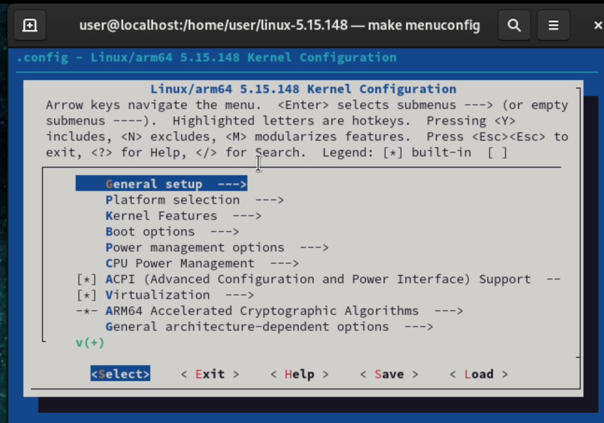
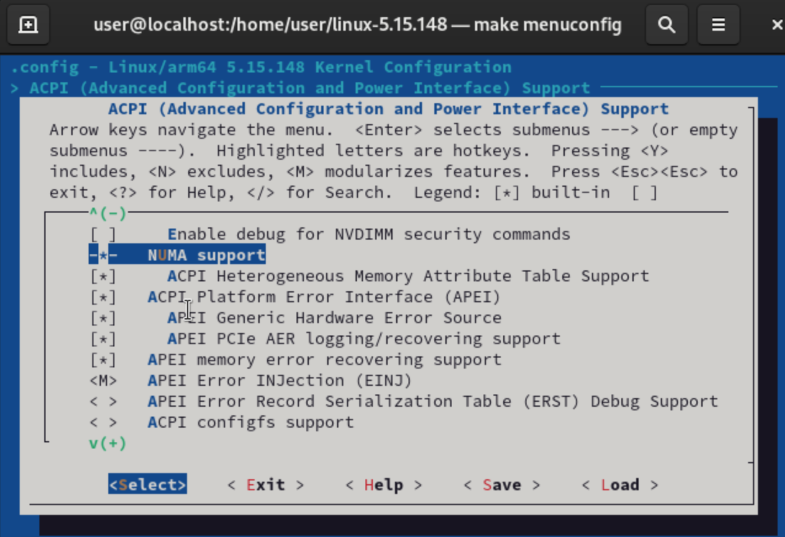

# **FTP server of this course**
```
Host name : csie2.nqu.edu.tw
Port : 21
User name : user2
Password : user1234@#
```

# **Update kernel**
1. Check current kernel version
```
[user@localhost ~]$ uname -r
5.14.0-419.el9.aarch64
```
2. Go to [kernel.org](https://www.kernel.org)
    - Copy the link of target version
```
wget https://cdn.kernel.org/pub/linux/kernel/v5.x/linux-5.15.148.tar.xz
```
3. Unzip file
```
tar xvJf linux-5.15.148.tar.xz
```
4. Install needed tools
```
yum install -y ncurses-devel make gcc bc bison flex elfutils-libelf-devel openssl-devel grub2
```
5. Copy current configuration file into new kernel
```
cd linux-5.15.148/
cp -v /boot/config-5.14.0-419.el9.aarch64 .config
```
6. Make menu configuration file
```
make menuconfig
```
- If success will show out below :
    - 

- When developing linux kernel, functions will be modulized
    - 

        - `[*]` : Means compile this feature into kernel, the dissadvantage it will have bigger size
        - `<M>` : It will make the feature become module, means it will load the feature into kernel if needed
        - `[ ]` : Won't load the feature into kernel
7. We now can just exit first and continue make operations

```
make bzImage
make modules
make
make modules_install
make install
```

# **Extra**
## **VFS**
- Virtual file system
```
- vfs
    |
    - /data1 (ext3)
    |   |- a.txt
    |
    - /data2 (ext4)
        |- b.txt
```
- When read & write file in different file system will be using different method
- For example : we want to copy file `a.txt` to `b.txt`, we only use the command
    - `cp /data1/a.txt /data2/b.txt`
    - This is because the VFS will help us to use target file system's method to read & write the target file