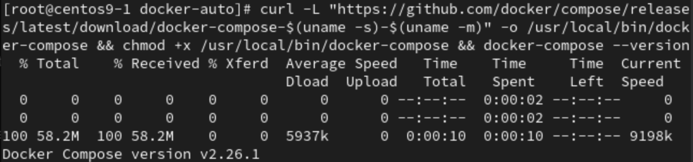
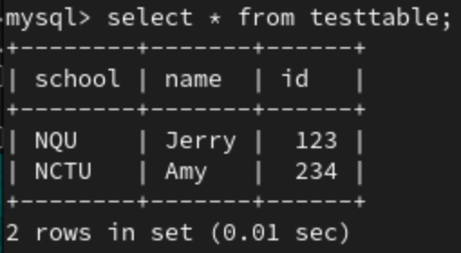
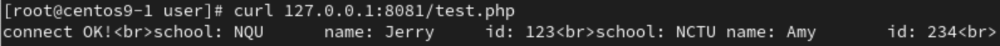

# **Docker Network**
- Show all docker's network
```
docker network ls
```
- 畫圖
    - If using default docker's network, can not use **name** to connect only **ip address**
    - If using created docker's network, we can use **name** and **ip address** to connect

# **Steps to learn docker** 
1. 1 vM with 1 docker
2. 1 VM with multiple dockers
    - multiple docker cooperate
3. Multiple VM with multiple dockers
    - multiple vm and multiple dockers cooperate
    - when 1 vm die, all services can move to another vm automatically
    - `docker compose`,`yaml`,`docker swarm`

# **Install docker compose**
```
curl -L "https://github.com/docker/compose/releases/latest/download/docker-compose-$(uname -s)-$(uname -m)" -o /usr/local/bin/docker-compose && chmod +x /usr/local/bin/docker-compose && docker-compose --version
```


# **Docker php&mysql**
1. Create a docker's network called `mynetwork` with `bridge` mode
```
docker network create -d bridge mynetwork
```
2. Run mysql docker
```
docker run -itd --network=mynetwork --name mydb -p 3306:3306 -e MYSQL_ROOT_PASSWORD=123456 mysql
```
3. Go into mysql docker 
```
docker exec -it mydb bin/bash
```
4. Go into mysql, password check step 2
```
mysql -u root -p
```
5. create database, and create data
```
create database testsql;
use testsql;
create table testtable(school char(5),name char(10),id int);
insert into testtable(school, name, id) values ('NQU','Jerry','123');
insert into testtable values ('NCTU','Amy','234');
```
- Done mysql docker setup


6. Create `php` file, `vim test.php`
```
<?php
$servername="mydb";
$username="root";
$password="123456";
$dbname="testsql";

$conn = new mysqli($servername, $username, $password, $dbname);

if($conn->connect_error){
	die("connecttion failed: " . $conn->connect_error);
}
else{
	echo "connect ok!" . "<br>";
}

$sql="select * from testtable;"
$result=$conn->query($sql);

if($result->num_rows>0){
	while($row=$result->fetch_assoc()){
		echo "school: " . $row["school"] . "\tname: " . $row["name"] . "\tid: " . $row["id"] . "<br>";
	}
}else {
	echo "0 record";
}
?>
```
7.  Run php docker
```
docker run -d -p 8081:80 --name my-apache-php-app --network mynetwork -v "/root/docker-auto":/var/www/html php:7.4-apache
```
- Test to curl data from docker
    - If error occurs check [Error](#errors)
```
curl 172.0.0.1:8081/test.php
```
- done

## **Errors**
1. When `curl 127.0.0.1:8081/test.php`, this is because docker **php:7.4-apache** does not contain **mysqli**
```
<br />
<b>Fatal error</b>:  Uncaught Error: Class 'mysqli' not found in /var/www/html/test.php:7
Stack trace:
#0 {main}
  thrown in <b>/var/www/html/test.php</b> on line <b>7</b><br />
```
- Solution, install **mysqli** and restart **php docker**
    1. Go into **my-apache-php-app** docker and install **mysqli**
    ```
    docker exec -it my-apache-php-app /bin/bash
    docker-php-ext-install mysqli
    ```
    2. After done exit **my-apache-php-app** docker and restart **my-apache-php-app** docker
    ```
    exit
    docker restart my-apache-php-app
    ```
# **Docker volume**

# **Docker network namespace**

## VETH
- Will create a pair of NIC and link together