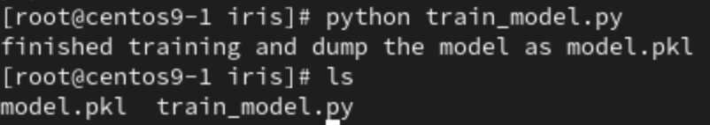

# **ML with VM**
1. Make a folder named `iris`, and create `train_model.py`
```
mkdir -p iris
vim train_model.py
```
- `train_model.py`
```
# coding: utf-8
import pickle
from sklearn import datasets
from sklearn.model_selection import train_test_split
from sklearn import tree

# simple demo for traing and saving model
iris=datasets.load_iris()
x=iris.data
y=iris.target

#labels for iris dataset
labels ={
  0: "setosa",
  1: "versicolor",
  2: "virginica"
}

x_train, x_test, y_train, y_test = train_test_split(x, y, test_size=.25)
classifier=tree.DecisionTreeClassifier()
classifier.fit(x_train,y_train)
predictions=classifier.predict(x_test)

#export the model
model_name = 'model.pkl'
print("finished training and dump the model as {0}".format(model_name))
pickle.dump(classifier, open(model_name,'wb'))
```
2. Train model through pip, install pip, install sklearn through pip
```
yum install -y python-pip
python -m pip install pip==20.3.4
pip install sklearn==
python train_model.py
```
- 
3. Install `flas` with `pip` command
```
pip install flask
```
4. server & client
- `server.py`
```
# coding: utf-8
import pickle

from flask import Flask, request, jsonify

app = Flask(__name__)

# Load the model
model = pickle.load(open('model.pkl', 'rb'))
labels = {
  0: "versicolor",   
  1: "setosa",
  2: "virginica"
}

@app.route('/api', methods=['POST'])
def predict():
    # Get the data from the POST request.
    data = request.get_json(force = True)
    predict = model.predict(data['feature'])
    return jsonify(predict[0].tolist())

if __name__ == '__main__':
    app.run(debug = True, host = '0.0.0.0')
```
- `client.py`
```
# coding: utf-8
import requests
# Change the value of experience that you want to test
url = 'http://127.0.0.1:5000/api'
feature = [[5.8, 2.0, 4.2, 3.2]]
labels ={
  0: "setosa",
  1: "versicolor",
  2: "virginica"
}

r = requests.post(url,json={'feature': feature})
print(labels[r.json()])
```
5. Run with `python`
```
python server.py
python client.py
```
- 

# **ML with Docker**
1. Docker pull needed python image
- Windows :
```
docker pull nitincypher/docker-ubuntu-python-pip
```
- Mac arm chip(m1,m2,m3) :
```
docker pull arm64v8/python:3.9.18
```
2. Create needed file `Dockerfile`,`requirements.txt`
- Dockerfile
```
vim Dockerfile
```
```
FROM nitincypher/docker-ubuntu-python-pip

COPY ./requirements.txt /app/requirements.txt

WORKDIR /app

RUN pip install -r requirements.txt

COPY server.py /app

COPY train_model.py /app

CMD python /app/train_model.py && python /app/server.py
```
- `requirements.txt`
- Python2
```
sklearn
flask
```
- Python3
```
scikit-learn
flask
```
3. Build
```
docker build -t iris:1.0 .
```
4. Run image
```
docker run -itd --name iris -p 5000:5000 iris:1.0
```

# **Gitlab with Docker**
1. ssh key for both 2 VM
```
ssh-keygen
cat /root/.ssh/id_rsa.pub
```
- Copy `cat /root/.ssh/id_rsa.pub` to gitlab SSH Keys
- 
2. Link to gitlab 
- use your gitlab's username and email
```
git config --global user.name "weixiang0470"
git config --global user.email s111010550@student.nqu.edu.tw
```
- Initial and push to gitlab, use your https
- 
```
git init
git remote add origin https://gitlab.com/weixiang0470/iris2024.git
git add .
git commit -m "Initial Commit"
git push -uf origin master
```
## **gitlab-runner**
### **VM-2**
1. Install gitlab-runner
- Windows :
```
curl -L --output /usr/local/bin/gitlab-runner https://gitlab-runner-downloads.s3.amazonaws.com/latest/binaries/gitlab-runner-linux-amd64
```
- Mac arm chip :
```
curl -LJO "https://s3.dualstack.us-east-1.amazonaws.com/gitlab-runner-downloads/latest/rpm/gitlab-runner_arm64.rpm"

rpm -ivh gitlab-runner_arm64.rpm
```
2. Give permission to gitlab-runner
- Windows :
```
chmod +x /usr/local/bin/gitlab-runner
```
- Mac arm chip:
```
chmod +x /usr/bin/gitlab-runner
```
3. Add user `GitLab Runner`
```
useradd --comment 'GitLab Runner' --create-home gitlab-runner --shell /bin/bash
usermod -aG docker gitlab-runner
```
4. Install and run gitlab-runner
- Windows :
```
/usr/local/bin/gitlab-runner install --user=gitlab-runner --working-directory=/home/gitlab-runner

/usr/local/bin/gitlab-runner start
```
- Mac arm chip :
```
/usr/bin/gitlab-runner install --user=gitlab-runner --working-directory=/home/gitlab-runner

/usr/bin/gitlab-runner start
```

4. Register gitlab-runner
```
gitlab-runner register
```
- Enter as below
    - `https://gitlab.com`
    - Token copied from your gitlab
        - 
    - `Centos_ML_iris` : description for your own
    - `ML_iris` : tag, is important for `.gitlab-ci.yml`
    - Enter
    - `shell`
- Result
```
Runtime platform                                    arch=arm64 os=linux pid=12965 revision=91a27b2a version=16.11.0
Running in system-mode.                            
                                                   
Enter the GitLab instance URL (for example, https://gitlab.com/):
https://gitlab.com
Enter the registration token:
GR1348941mYSzb3WQ9QeDh9zp3_LT
Enter a description for the runner:
[centos9-2]: Centos_ML_iris
Enter tags for the runner (comma-separated):
ML_iris
Enter optional maintenance note for the runner:

WARNING: Support for registration tokens and runner parameters in the 'register' command has been deprecated in GitLab Runner 15.6 and will be replaced with support for authentication tokens. For more information, see https://docs.gitlab.com/ee/ci/runners/new_creation_workflow 
Registering runner... succeeded                     runner=GR1348941mYSzb3WQ
Enter an executor: shell, docker+machine, instance, docker-windows, kubernetes, docker-autoscaler, custom, ssh, parallels, virtualbox, docker:
shell
Runner registered successfully. Feel free to start it, but if it's running already the config should be automatically reloaded!
 
Configuration (with the authentication token) was saved in "/etc/gitlab-runner/config.toml" 
```
- 
### **VM-1**
1. Under iris folder
```
vim .gitlab-ci.yml

stages:
  - deploy

docker-deploy:
  stage: deploy
  script:
    - docker build -t iris .
    - if [ $(docker ps -aq --filter name=iris) ]; then docker rm -f iris; fi
    - docker run -d -p 5000:5000 --name iris iris
  tags:
    - ML_iris
```
2. Add and push to gitlab
```
git add .
git commit -m "second commit"
git push -uf origin master
```
3. done


- Change ip address of `client.py` to vm2's ip address for checking 

