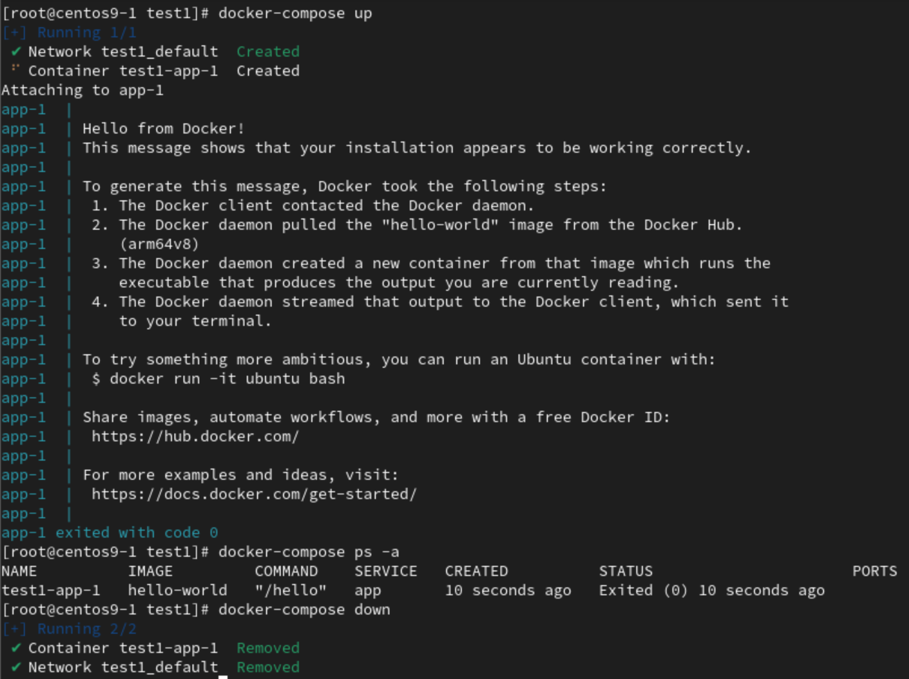
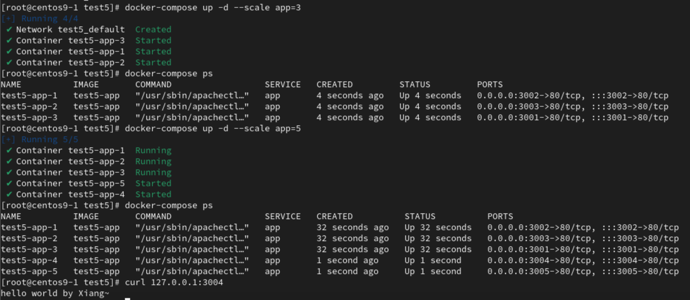
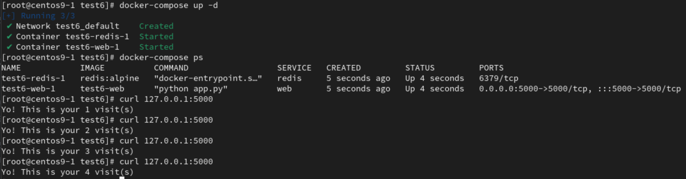
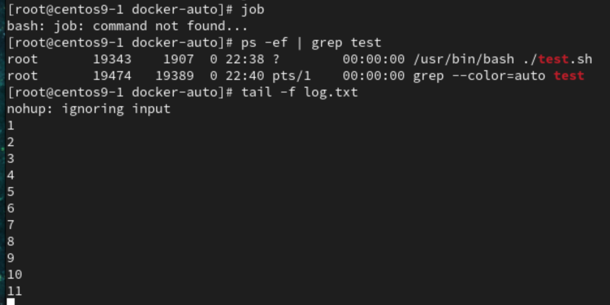

# **Docker-swarm**
- `Master node` and many `work nodes` combine become `cluster`
- `Master node` assign works to `work node`
- If 1 of the `work node` crashed then the work will move to another `work node`
# **Docker compose**
-  Install `docker compose`
```
curl -L "https://github.com/docker/compose/releases/latest/download/docker-compose-$(uname -s)-$(uname -m)" -o /usr/local/bin/docker-compose && chmod +x /usr/local/bin/docker-compose && docker-compose --version
```

## **Hello-world(test1)**
1. Create `test` folder
```
mkdir test-docker-compose
cd test-docker-compose
mkdir test1
cd test1
```
2. Create & edit `docker-compose.yml`file
```
vim docker-compose.yml
```
```
services:
    app:
        image: hello-world
```
3. Common commands of `docker-compose`
```
docker-compose up
docker-compose ps -a
docker-compose down
```
- 
## **test2**
1. Create `test2` folder
```
mkdir test2
cd test2
```
2. Create & edit `Dockerfile` file
```
vim Dockerfile
```
```
FROM alpine
	 
RUN apk add --no-cache bash
 
CMD bash -c 'for((i=1;;i+=1)); do sleep 1 && echo "Counter: $i"; done'
```
3. Create & edit `docker-compose.yml` file
```
docker-compose.yml
``` 
```
services:
  app:
    build:
      context: .
```
4. Docker-compose build
```
docker-compose build
``` 
- Result 1
```
[+] Building 38.7s (7/7) FINISHED                                                                                                              docker:default
 => [app internal] load build definition from Dockerfile                                                                                                 0.0s
 => => transferring dockerfile: 153B                                                                                                                     0.0s
 => [app internal] load metadata for docker.io/library/alpine:latest                                                                                     2.9s
 => [app auth] library/alpine:pull token for registry-1.docker.io                                                                                        0.0s
 => [app internal] load .dockerignore                                                                                                                    0.0s
 => => transferring context: 2B                                                                                                                          0.0s
 => [app 1/2] FROM docker.io/library/alpine:latest@sha256:c5b1261d6d3e43071626931fc004f70149baeba2c8ec672bd4f27761f8e1ad6b                               2.5s
 => => resolve docker.io/library/alpine:latest@sha256:c5b1261d6d3e43071626931fc004f70149baeba2c8ec672bd4f27761f8e1ad6b                                   0.0s
 => => sha256:c5b1261d6d3e43071626931fc004f70149baeba2c8ec672bd4f27761f8e1ad6b 1.64kB / 1.64kB                                                           0.0s
 => => sha256:a0264d60f80df12bc1e6dd98bae6c43debe6667c0ba482711f0d806493467a46 528B / 528B                                                               0.0s
 => => sha256:ace17d5d883e9ea5a21138d0608d60aa2376c68f616c55b0b7e73fba6d8556a3 1.49kB / 1.49kB                                                           0.0s
 => => sha256:bca4290a96390d7a6fc6f2f9929370d06f8dfcacba591c76e3d5c5044e7f420c 3.35MB / 3.35MB                                                           2.4s
 => => extracting sha256:bca4290a96390d7a6fc6f2f9929370d06f8dfcacba591c76e3d5c5044e7f420c                                                                0.1s
 => [app 2/2] RUN apk add --no-cache bash                                                                                                               33.3s
 => [app] exporting to image                                                                                                                             0.0s
 => => exporting layers                                                                                                                                  0.0s
 => => writing image sha256:197a137caee8fa4fb93102187593464c99868f2bad446367c822005f5b988e93                                                             0.0s
 => => naming to docker.io/library/test2-app 
```
- Result 2
```
[root@centos9-1 test2]# docker images                                  
REPOSITORY        TAG                  IMAGE ID       CREATED              SIZE
test2-app         latest               197a137caee8   About a minute ago   11.9MB
```
5. Run in background with `docker-compose up -d`
```
docker-compose up -d
```
- Result
```
[+] Running 2/2
 ✔ Network test2_default  Created    0.1s 
 ✔ Container test2-app-1  Started    0.0s 
```
6. Show `docker-compose` process
```
docker-compose ps
```
- Result
```
NAME          IMAGE       COMMAND                  SERVICE   CREATED         STATUS         PORTS
test2-app-1   test2-app   "/bin/sh -c 'bash -c…"   app       4 seconds ago   Up 4 seconds
```
7. Monitor and shutdown
```
docker-compose logs
docker-compose down
```
## **test3**
1. Create `test3` folder
```
mkdir test3
cd test3
```
2. Create & edit `docker-compose.yml` file
```
vim docker-compose.yml
```
```
services:
  app:
    build:
      context: .
    image: counter
    command: >
      bash -c 'for((i=1;;i+=2)); do sleep 1 && echo "Counter: $$i"; done'
```
3. Copy `Dockerfile` from `test2`
```
cp ../test2/Dockerfile .
```
4. Run in background
```
docker-compose up -d
```
- Result
```
[+] Running 1/1
 ! app Warning pull access denied for counter, repository does not exist or may require 'docker login': denied: requested access to the ...              3.9s 
[+] Building 1.8s (7/7) FINISHED                                                                                                               docker:default
 => [app internal] load build definition from Dockerfile                                                                                                 0.0s
 => => transferring dockerfile: 153B                                                                                                                     0.0s
 => [app internal] load metadata for docker.io/library/alpine:latest                                                                                     1.7s
 => [app auth] library/alpine:pull token for registry-1.docker.io                                                                                        0.0s
 => [app internal] load .dockerignore                                                                                                                    0.0s
 => => transferring context: 2B                                                                                                                          0.0s
 => [app 1/2] FROM docker.io/library/alpine:latest@sha256:c5b1261d6d3e43071626931fc004f70149baeba2c8ec672bd4f27761f8e1ad6b                               0.0s
 => CACHED [app 2/2] RUN apk add --no-cache bash                                                                                                         0.0s
 => [app] exporting to image                                                                                                                             0.0s
 => => exporting layers                                                                                                                                  0.0s
 => => writing image sha256:437d8a3994eaa3c4413874cb267bfb8e5c1e4ca1c2ebd8d24fea6e68d89ed566                                                             0.0s
 => => naming to docker.io/library/counter                                                                                                               0.0s
[+] Running 2/2
 ✔ Network test3_default  Created                                                                                                                        0.1s 
 ✔ Container test3-app-1  Started
```
## **test4**
1. Create `mydata` folder at `/`
```
cd /
mkdir mydata
cd mydata
touch {1..10}
```
2. Create `test4` folder
```
cd /root/test-docker-compose
mkdir test4
cd test4
```
3. Create & edit `docker-compose.yml` file
```
vim docker-compose.yml
```
```
services:
    app:
        image: busybox
        volumes:
            - /mydata:/docker-mydata
```
- Not done yet
## **test5**
1. Create `test5` folder
```
mkdir test5
cd test5
```
2. Create `index.html`, create & edit `Dockerfile` file
```
echo "hello world by Xiang~" > index.html
```
- Dockerfile
```
vim Dockerfile
```
```
FROM centos:centos7
RUN yum -y install httpd
EXPOSE 80
ADD index.html /var/www/html
CMD ["/usr/sbin/apachectl","-DFOREGROUND"]
```
- yml file
```
vim docker-compose.yml
```
```
services:
    app:
        build:
            context: .
        ports:
            - "3000-3063:80"
```
3. Run in background
```
docker-compose up -d
docker-compose ps
```
- Result
```
NAME          IMAGE       COMMAND                  SERVICE   CREATED          STATUS          PORTS
test5-app-1   test5-app   "/usr/sbin/apachectl…"   app       13 seconds ago   Up 12 seconds   0.0.0.0:3000->80/tcp, :::3000->80/tcp
```
4. Testing with `curl`
```
curl 127.0.0.1:3000
```
- Result
```
hello world by Xiang~
```
5. scale up
```
docker-compose up -d --scale app=3
```
- Result
    - 

## **test6**
1. Create `test6` folder
```
mkdir test6
cd test6
```
2. Create & edit `app.py`,`requirement.txt`,`Dockerfile`,`docker-compose.yml` files
- `app.py`
```
vim app.py
``` 
```
import time
import redis
from flask import Flask

app = Flask(__name__)
cache = redis.Redis(host='redis', port=6379)

def get_hit_count():
    retries=5
    while True:
        try:
            return cache.incr('hits')
        except redis.exceptions.ConnectionError as exc:
            if retries==0:
                raise exc
            retries-=1
            time.sleep(0.5)

@app.route('/')
def get_index():
    count = get_hit_count()
    return 'Yo! This is your {} visit(s)\n'.format(count)

if __name__ == "__main__":
    app.run(host="0.0.0.0", debug=True)
```
- `requirement.txt`
```
vim requirement.txt
```
```
flask
redis
```
- `Dockerfile`
```
vim Dockerfile
```
```
FROM python
ADD . /code
WORKDIR /code
RUN pip install -r requirement.txt
CMD ["python", "app.py"]
```
- `docker-compose.yml`
```
vim docker-compose.yml
```
```
services:
    web:
        build: .
        ports:
        - "5000:5000"
        volumes:
        - .:/code
        depends_on:
            - redis
    redis:
        image: "redis:alpine"
```


3. Run in background
```
docker-compose up -d
```
- Result
    - 


## **docker-compose.yml**
```
services:
    app:
        build:
            context: .
        volumes:
            - /mydata:/docker-mydata
        ports:
            - "3000-3063:80"
```
- `volumes`, for mount host's file `mydata` to docker container `docker-mydata`
- `ports`, for port on host (3000 to 3063) on docker container (80)

# **Extra**
## **Background and Frontground commands**
```
commands & (Execute commands in background)
jobs (Show all jobs)
fg 2 (Bring job-2 to frontground)
Ctrl + Z (Pause)
bg 2 (Move job-2 to background)
```
- All output and error will put into `log.txt` file in background
```
./test.sh >log.txt 2>&1 &
tail -f log.txt
```
- Will keep the commands execute even when terminal closed
```
nohup ./test.sh >log.txt 2>&1 &
```
- done
- 