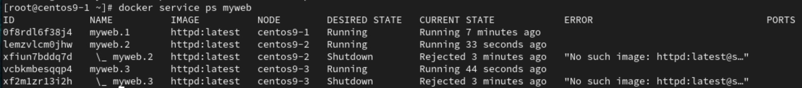
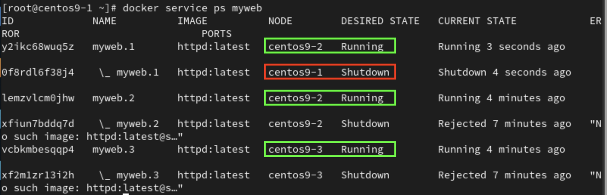
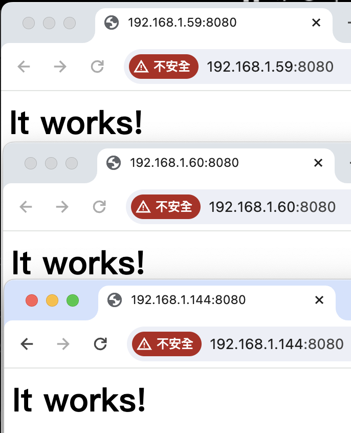
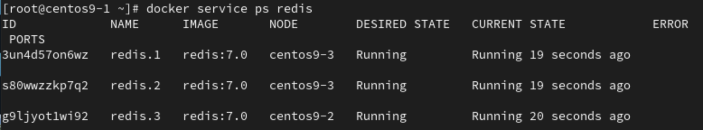

# **1Panel**
1. Install
```
curl -sSL https://resource.fit2cloud.com/1panel/package/quick_start.sh -o quick_start.sh && sh quick_start.sh
```
- Login done
    - 


# **Docker-swarm**
- Requirements
    1. 3 VM 
    2. VM ip address
        - `centos9-1` : `192.168.1.60`
        - `centos9-2` : `192.168.1.59`
        - `centos9-3` : `192.168.1.144`
## **VM-1(Master node)**
1. `Step 1` : Initial docker-swarm
```
docker swarm init --advertise-addr 192.168.1.60
```
- Result
```
Swarm initialized: current node (j8ogimfb7rzlxa2bokrlwu4hk) is now a manager.

To add a worker to this swarm, run the following command:

    docker swarm join --token SWMTKN-1-4qe8bmg9i67yueoyhcold4um30l2gvzhby92m0q7uvygotzsao-6pzw15k339axne39btojnt1dc 192.168.1.60:2377

To add a manager to this swarm, run 'docker swarm join-token manager' and follow the instructions.
```
- `docker node ls` : list all nodes
```
ID                            HOSTNAME    STATUS    AVAILABILITY   MANAGER STATUS   ENGINE VERSION
j8ogimfb7rzlxa2bokrlwu4hk *   centos9-1   Ready     Active         Leader           26.0.0
e9t56pbzjne9j1z3p12zaev8c     centos9-2   Ready     Active                          26.0.1
akvvtcul0ba7f87qw2oh02uki     centos9-3   Ready     Active                          26.1.2
```
2. `Step 3` : Create a service and run on random node
```
docker service create  --name myweb httpd
```
- `docker service ps myweb`
```
ID             NAME      IMAGE          NODE        DESIRED STATE   CURRENT STATE            ERROR     PORTS
0f8rdl6f38j4   myweb.1   httpd:latest   centos9-1   Running         Running 29 seconds ago
```
3. `Step 4` : Scale up & donw
```
docker service scale myweb=3
```
- 
4. `Step 5` : Make all works on worker node
```
docker node update --availability drain centos9-1
```
- 
- `docker node update --availability active centos9-1` : Let master node join to work
5. `Step 6` : Make service myweb available to public with 8080 port
```
docker service update --publish-add 8080:80 myweb
```
- 

## **VM-2(Work node)**
1. `Step 2` : Join into master's cluster as a worker node
```
docker swarm join --token SWMTKN-1-4qe8bmg9i67yueoyhcold4um30l2gvzhby92m0q7uvygotzsao-6pzw15k339axne39btojnt1dc 192.168.1.60:2377
```
- Result
```
This node joined a swarm as a worker.
```
## **VM-3(Word node)**
1. `Step 2` : Join into master's cluster as a worker node
```
docker swarm join --token SWMTKN-1-4qe8bmg9i67yueoyhcold4um30l2gvzhby92m0q7uvygotzsao-6pzw15k339axne39btojnt1dc 192.168.1.60:2377
```
- Result
```
This node joined a swarm as a worker.
```
## **docker swarm commands**
1. `docker service ls` : list service
2. `docker service create --name myweb httpd` : Create service http, service name is myweb
    - `docker service scale myweb=3` : Scale up service myweb to 3
    - `docker service create --name myweb --replicas 3 httpd` : Create 3 services(myweb)

## **Rolling update**
1. On all VM run command below, may need to login first
```
docker pull redis:7.0
```
2. On VM-1 run command below
```
docker service create   --replicas 3   --name redis   --update-delay 10s   redis:7.0
```
- 