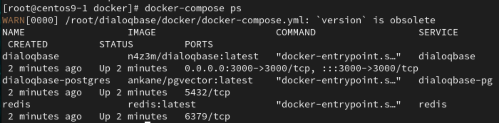
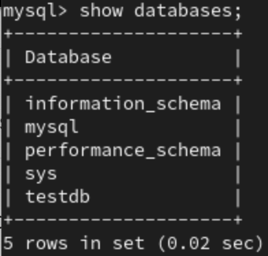
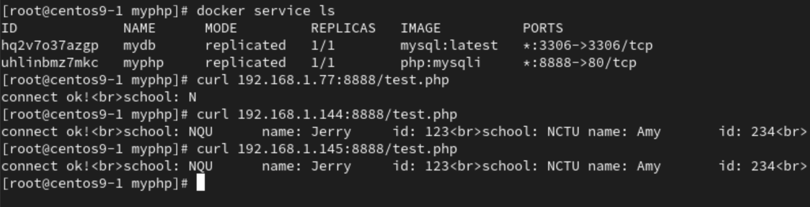

# **ChatGPT-dialoqbase**
- 大範圍的問題回答得還不錯， 例如：金門縣長是誰？金門有什麼好玩的？金門有什麼好吃的？
- 較侷限的問題就有問題， 例如：金門大學資訊工程學系的老師有誰？金門大學的校長是誰？
    - 會回答錯誤等

1. Clone dialoqbase from github
```
git clone https://github.com/n4ze3m/dialoqbase.git
```
2. Paste api-key into `.env`
```
cd dialoqbase/docker/
vim .env
# paste your openai api-key
```
3. Start with docker-compose
```
docker-compose up -d
docker-compose ps 
```
- 
4. Train via host browser
```
http://192.168.1.77:3000/#/login
```

# **Docker-swarm with DB**
- Requirements 3-VMs
    - master_node ip : `192.168.1.77`
    - worker node ip : `192.168.1.145`,`192.168.1.144`
- Install
    - nfs : `sudo yum install nfs-utils`, on all VM
## **Master node**
1. On all 3 VMs, master node and 2 worker nodes
```
sudo cd /
sudo mkdir mydb myphp
```
2. Add export files
```
vim /etc/exports
```
```
/mydb/ 192.168.1.0/24(rw,sync,no_root_squash,no_all_squash)
/myphp/ 192.168.1.0/24(rw,sync,no_root_squash,no_all_squash)
```
3. Start nfs
```
sudo systemctl restart rpcbind
sudo systemctl restart nfs-server
# x86 architecture use sudo systemctl start nfs
```
```
showmount -e localhost
```
- result 
```
Export list for localhost:
/myphp/ 192.168.1.0/24
/mydb/  192.168.1.0/24
```
4. Initial docker swarm
```
docker swarm init
```
- result
```
Swarm initialized: current node (14sjfql5a0q3spqllz8vgit5t) is now a manager.

To add a worker to this swarm, run the following command:

    docker swarm join --token SWMTKN-1-3uu6f1naug4srej0vp98nkxx326q6ytmex7knxexdn6z13lah6-8vi8n8pe7cxzww3d6hsyg0o8r 192.168.1.77:2377

To add a manager to this swarm, run 'docker swarm join-token manager' and follow the instructions.
```
## **Worker node 1&2**
5. Start and mount on nfs
```
sudo systemctl restart rpcbind
sudo mount -t nfs 192.168.1.77:/mydb /mydb
sudo mount -t nfs 192.168.1.77:/myphp /myphp
```
6. Join into docker swarm
```
docker swarm join --token SWMTKN-1-3uu6f1naug4srej0vp98nkxx326q6ytmex7knxexdn6z13lah6-8vi8n8pe7cxzww3d6hsyg0o8r 192.168.1.77:2377
```
## **Master node**
7. Create docker network 
```
docker network create -d overlay mynet
docker node update --availability drain centos9-1
```
- result
```
deex63jqzfej   mynet             overlay   swarm
```
8. Create docker service `mydb`
```
docker service create --name mydb --network mynet --mount type=bind,source=/mydb,target=/var/lib/mysql --env MYSQL_ROOT_PASSWORD=123456 --publish published=3306,target=3306 mysql
```
- result
```
ID             NAME      IMAGE          NODE        DESIRED STATE   CURRENT STATE            ERROR     PORTS
tjtworngcx9u   mydb.1    mysql:latest   centos9-3   Running         Running 35 seconds ago
```

## **worker node(centos9-3)**
9. `docker ps` to check id and go into container
```
docker exec -it 6d6 bash
```
```
mysql -u root -p
# enter password: 123456
create database testdb;
show databases;
```
- result 
    - 
10. Go to Master node `docker service rm mydb` and start again with command at **step 8**
    - Go into container, `testdb` will still there
    - create data with command below,
    ```
    create database testsql;
    use testsql;
    create table testtable(school char(5),name char(10),id int);
    insert into testtable(school, name, id) values ('NQU','Jerry','123');
    insert into testtable values ('NCTU','Amy','234');
    ```
## **Master node**
11. Go to `myphp` and create `test.php`
```
cd /myphp
vim test.php
```
```
<?php
$servername="mydb";
$username="root";
$password="123456";
$dbname="testsql";

$conn = new mysqli($servername, $username, $password, $dbname);

if($conn->connect_error){
	die("connecttion failed: " . $conn->connect_error);
}
else{
	echo "connect ok!" . "<br>";
}

$sql="select * from testtable";
$result=$conn->query($sql);

if($result->num_rows>0){
	while($row=$result->fetch_assoc()){
		echo "school: " . $row["school"] . "\tname: " . $row["name"] . "\tid: " . $row["id"] . "<br>";
	}
}else {
	echo "0 record";
}
?>
```
12. Create docker service `myphp`
- Windows : 
```
docker service create --name myphp --network mynet --mount type=bind,source=/myphp,target=/var/www/html --publish published=8888,target=80 radys/php-apache:7.4
```
- Mac m1 :
    - Build image `php:mysqli` on all VMs, with [Dockerfile](./README.md#dockerfile)
```
docker service create --name myphp --network mynet --mount type=bind,source=/myphp,target=/var/www/html --publish published=8888,target=80 php:mysqli
```

```
curl 192.168.1.77:8888/test.php
curl 192.168.1.144:8888/test.php
curl 192.168.1.145:8888/test.php
```
- Result
    - 

# **Dockerfile**
- `php:mysqli` 
    - command : `docker build -t php:mysqli .`
```
FROM php:7.4-apache
RUN docker-php-ext-install mysqli
```
