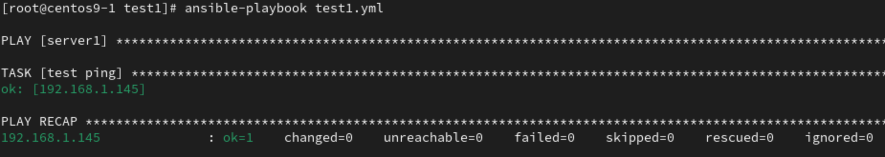

# **LLM**
- [huggingface](https://huggingface.co/)
- openai: chatgpt, google:gemini, meta:llama 3, aws: Anthropic(claude)

# **Ansible**
- Similar tools : puppet, chef, saltstack
- Suitable to small scale
## **Requirement**
- centos1 : `192.168.1.89`(server)
- centos2 : `192.168.1.145`
- centos3 : `192.168.1.144`
1. configure `/etc/hosts`
```
vim /etc/hosts
```
```
192.168.1.89 centos1
192.168.1.145 centos2
192.168.1.144 centos3
```
2. No password login
```
ssh-keygen
ssh-copy-id root@centos2
ssh-copy-id root@centos3
```
3. Copy hosts to all vm
```
scp /etc/hosts root@centos2:/etc/hosts
scp /etc/hosts root@centos3:/etc/hosts
```
4. Install ansible
```
yum install -y ansible
```
5. Configure ansible hosts
```
vim /etc/ansible/hosts
```
```
[server1]
192.168.1.145 #centos2
[server2]
192.168.1.144 #centos3
[servers]
192.168.1.145
192.168.1.144
```
6. Test
```
ansible server1 -m ping
ansible server2 -m ping
ansible servers -m ping
```
- Result
    - 

## **test1**
1. create folder
```
mkdir test1
cd test1
```
2. create `yml` file
```
vim test1.yml
```
```
---
- hosts: server1
  gather_facts: no
  tasks:
    - name: test ping
      ping:
```
3. test yml
```
ansible-playbook test1.yml
```
- Result
    - 


## **Commands**
- list all modules
```
ansible-doc -l
```
- command module
    - chdir : change to this directory 
```
ansible server1 -m command -a "ifconfig"
ansible server1 -m command -a "chdir=/var ls"
```

- shell module
```
ansible server1 -m shell -a "ifconfig | grep ens160"
```
## **Errors**
1. `ssh-copy-id`
```
sign_and_send_pubkey: signing failed for RSA "user@centos9-1" from agent: agent refused operation
```
- Solution : 
```
eval "$(ssh-agent -s)"
ssh-add
```