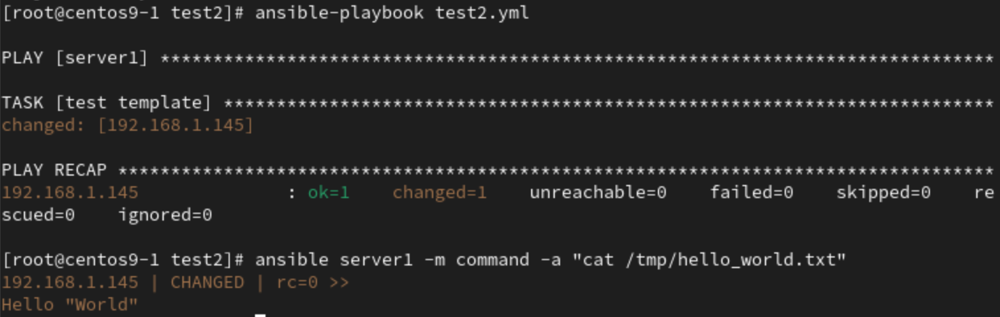

# **Ansible with ubuntu**
- Requirements:
    - 3 VM
        - Centos1 : `192.168.1.89`
        - Centos2 : `192.168.1.145`
        - Ubuntu1 : `192.168.1.54`
    - Set ip & hostname (`vim /etc/hosts`)
1. Install ssh on ubuntu
```
sudo apt install openssh-server
systemctl start ssh
systemctl status ssh
```
- `vim /etc/ssh/sshd_config` : set `PermitRootLogin yes`
2. Configure hosts on `Centos1`
```
vim /etc/ansible/hosts
```
```
[server1]
192.168.1.145 #centos2
[server2]
192.168.1.54 #ubuntu
```
3. Test all servers with ping module
```
ansible servers -m ping
```
- Result 
    - 

# **Ansible commands**
1. `ansible server1 -m command -a "creates=b touch b"`
    - `creates=b`, if b does not exists then execute following command
```
[root@centos9-1 test1]# ansible server1 -m command -a "creates=b touch b"
192.168.1.145 | CHANGED | rc=0 >>
# b does not exists, then create b
[root@centos9-1 test1]# ansible server1 -m command -a "creates=b touch b"
192.168.1.145 | SUCCESS | rc=0 >>
skipped, since b existsDid not run command since 'b' exists
# b exist, no action
```
2. `ansible server1 -m yum -a "name=httpd,curl state=present"`
    - use to install or remove 
    - `name=httpd,curl` : target httpd and curl
    - `state=present` : Install
        - `state=absent` : Remove
3. `ansible server1 -m service -a "name=httpd state=stopped"`
    - use to start or stop service
    - `name=httpd` : Target httpd
    - `state=started` : Start target service
4. `ansible server1 -m script -a "./a.sh"`
    - Execute `a.sh` script on server1
5. `ansible server1 -m file -a path=/tmp/hello.txt state=absent`
    - `state=absent` : Remove file
    - `state=directory` : Create directory
    - `"path=/tmp/hello.txt owner=user group=user mode=0755"` : create `hello.txt` under `/tmp`
## **Remote Copy**
1. `ansible server1 -m coopy -a "src=./hello.txt" dest=/tmp/hello.txt owner=user group=user mode=0644`

2. Use template
### **Use template**
1. create files: `hi.j2`,`test2.yml`
```
echo 'Hello "{{ dynamic_world }}"' > hi.j2
```
```
vim test2.yml
```
```
---
- hosts: server1
  gather_facts: no
  vars:
    dynamic_world: "World"
  tasks:
    - name: test template
      template:
        src: hi.j2
        dest: /tmp/hello_world.txt
```
2. execute
```
ansible-playbook test2.yml
```
3. Test 
```
ansible server1 -m command -a "cat /tmp/hello_world.txt"
```
- Resutle
    - 

## **HW1**
- Target : After `ansible-playbook`, do `curl http://centos2:8080/hi.htm` will show _**Hi**_
1. Prepare `hi.htm`
```
vim a.txt
```
```
Hi~
This is Xiang ~M3~
```
2. Prepare `.yml` file
```
vim test3.yml
```
```
---
- hosts: server1
  gather_facts: no
  become: true
  tasks:
    - name: install httpd
      package:
          name: httpd
          state: present
    - name: Copy a.txt to target
      copy:
          src: /root/ansible-test/test3/a.txt
          dest: /var/www/html/hi.htm
    - name: Delete Listen 80
      lineinfile:
        path: /etc/httpd/conf/httpd.conf  #regexp: '^Listen '
        state: absent
        regexp: '^Listen '
    - name: Insert Listen 8080
      lineinfile:
        path: /etc/httpd/conf/httpd.conf
        regexp: '^#Listen '
        insertafter: '^#Listen '
        line: Listen 8080
    - name: start httpd
      service:
        name: httpd
        state: restarted
```
3. Start playbook
```
ansible-playbook test3.yml
```
4. Test with `curl`
```
curl http://centos2:8080/hi.htm
```
- Result
    - 