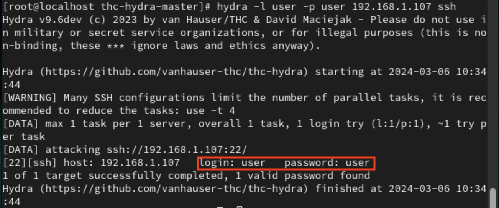
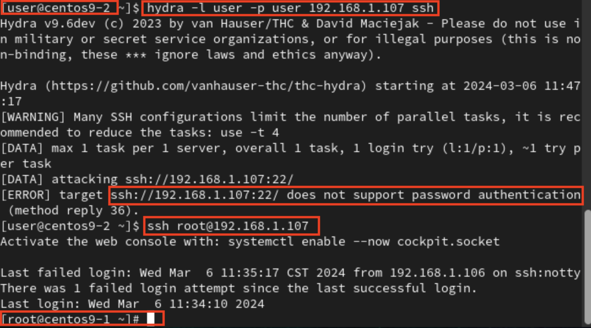
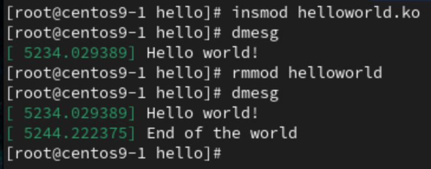

# **ssh attack**
## **Through Hydra**
- Install Hydra
```
wget https://github.com/vanhauser-thc/thc-hydra/archive/master.zip
yum -y install gcc libssh-devel openssl-devel
yum install -y unzip zip
unzip master.zip
cd thc-hydra-master/
./configure
make &&make install
```
- You will need target's ip address, possible password.txt, possible username.txt
```
hydra -L username.txt -P password.txt 192.168.1.107 ssh
```
- Result


### **Defence**
- `vim /etc/ssh/sshd_config`
    - Set `PasswordAuthentication no`
    - Will get refused when using hydra
- And use no password login, like RSA key...
## **Through nmap & CVE**
- Download scaning tool
```
yum -y install nmap
```
- Scan available device 
```
nmap -sS -P0 -sV ip_address_gateway/24
```
- ssh cve (google search), if the host is on the web then follow the step to attack

# **rsa key login**
- target device : `192.168.1.107`
- On local device
```
ssh-keygen
```
- Copy public_key to target device (need to enter password)
```
ssh-copy-id root@192.168.1.107
```
- Result


## **Problem&Solution**
1. When entering password, keep saying wrong password/ denied
    - `vim /etc/ssh/sshd_config`
    - Set `PermitRootLogin yes`
    - This will allow you to copy rsa to root

# **MyFirst Driver**
- `helloworld.c`
```
#include <linux/init.h>
#include <linux/module.h>
#include <linux/kernel.h>
MODULE_DESCRIPTION("Hello world");
MODULE_LICENSE("GPL");
static int __init hellowolrd_init(void) {
    pr_info("Hello world!\n");
    return 0;
}
static void __exit hellowolrd_exit(void) {
    pr_info("End of the world\n");
}
module_init(hellowolrd_init);
module_exit(hellowolrd_exit);
```
- `Makefile`
```
obj-m	+= helloworld.o
KVERSION := $(shell uname -r)
all:
	$(MAKE) -C /lib/modules/$(KVERSION)/build M=$(PWD) modules
clean:
	$(MAKE) -C /lib/modules/$(KVERSION)/build M=$(PWD) clean
```
1. Use command "make" to make `.ko` and related files
```
make
```
2. After make will give some files like `helloworld.mod`,`helloworld.ko`,`helloworld.mod.o`,... But we only need `helloworld.ko`.
    - We can use command `dmesg -C > /dev/null` to clean other messages
    - To insert module
```
insmod helloworld.ko
```
3. To remove module
```
rmmod helloworld
```
- Result



## **Problem&Solution**
1. `make`
```
make -C /lib/modules/5.14.0-419.el9.aarch64/build M=/home/user/hello modules
make[1]: *** /lib/modules/5.14.0-419.el9.aarch64/build: No such file or directory.  Stop.
make: *** [Makefile:8: modules] Error 2
```
- Solution: Update to kernel 5.15
# **Extra**
## **Chrome Extension**
- 沉浸式翻譯 : translation, pdf,video,...
    - But the video need to have cc subtitle function
- 通譯聽悟 : video subtitle, need china phone number