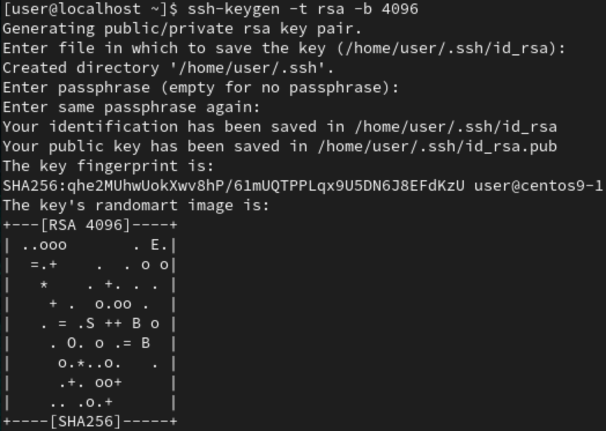
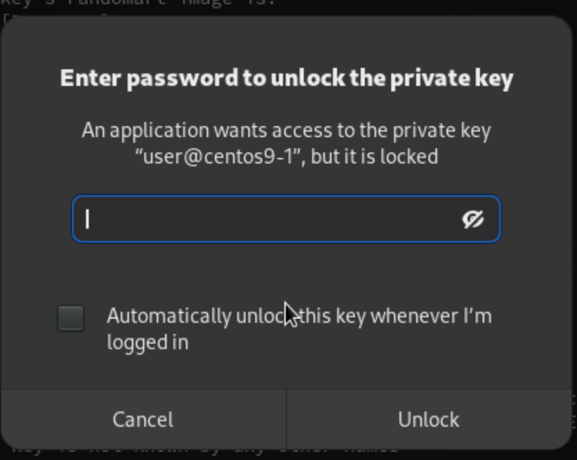
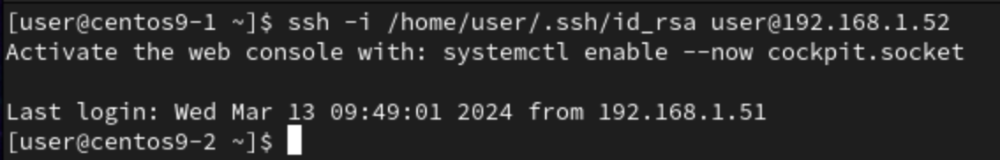
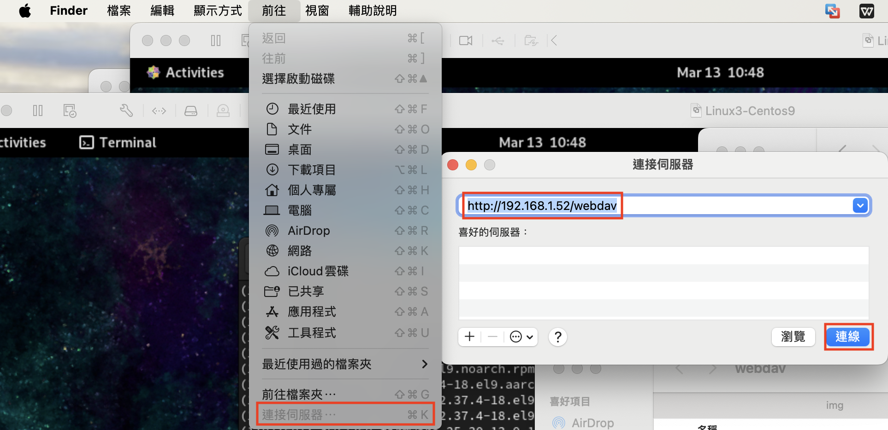
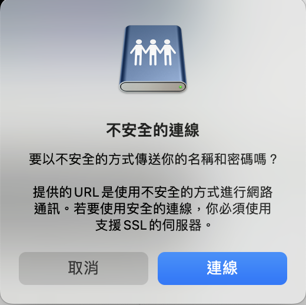
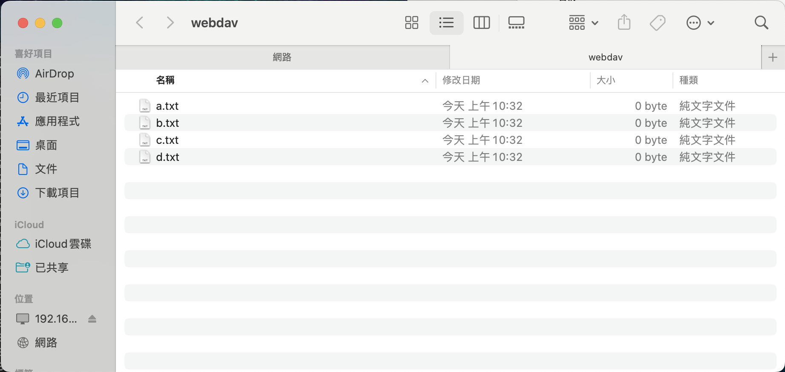

# **RSA key login 2**

## **Server side**
- `ifconfig` : to check ip address,`192.168.1.52`
1. Make sure ssh server is working
    - `yum install -y sshd` : to install ssh server
```
sudo systemctl status sshd
```
2. Remove all files in `.ssh` to have a clean environment
```
rm -rf .ssh
```
3. To make a new `.ssh` folder
```
mkdir -p .ssh
```
4. To change permission of folder `.ssh`
```
chmod 700 .ssh
```
5. Wait client side to finish `scp id_rsa.pub user@192.168.1.52:/home/user/.ssh/centos9.pub`

6. Go into `.ssh` and list files
```
cd .ssh
ls
```
7. Put centos9's public keys into `authorized_keys`
```
cat centos9.pub > authorized_keys
```
8. Change permission of `authorized_keys`
```
chmod 600 authorized_keys
```
## **Client side**
### **Windows**
1. Install putty
### **Centos & Mac**
1. Remove `.ssh` folder and all files inside
```
rm -rf .ssh
```
2. Generate ssh's key with **RSA** algorithm and **4096** length
```
ssh-keygen -t rsa -b 4096
```

3. Go in `.ssh` and list files
```
cd .ssh
ls
```
4. Copy public key into server side
```
scp id_rsa.pub user@192.168.1.52:/home/user/.ssh/centos9.pub
```
5. Wait server side to finish put public key into `authorized_keys` and `chmod 600 authorized_keys`

6. Use ssh to login into server side and specific private key at `/home/user/.ssh/id_rsa`
```
ssh -i /home/user/.ssh/id_rsa user@192.168.1.52
```


- Enter the password when `ssh-keygen`, only first time login need this

7. Result


# **WebDav**
## **Server side**
1. Install needed tools
```
yum install -y epel-release
yum install -y httpd
```
2. 
```
mkdir /var/www/html/webdav
```
3.  
```
cd /var/www/html/webdav/
```
4.  
```
touch {a..d}.txt
```
5. 
```
vim /etc/httpd/conf.d/webdav.conf
``` 
- Enter below code
```
DavLockDB /var/www/html/DavLock
<VirtualHost *:80>
    ServerAdmin webmaster@localhost
    DocumentRoot /var/www/html/webdav/
    ErrorLog /var/log/httpd/error.log
    CustomLog /var/log/httpd/access.log combined
    Alias /webdav /var/www/html/webdav
    <Directory /var/www/html/webdav>
        DAV On
        #AuthType Basic
        #AuthName "webdav"
        #AuthUserFile /etc/httpd/.htpasswd
        #Require valid-user
    </Directory>
</VirtualHost>
```
6. 
```
chmod -R 755 /var/www/html
```
7. 
```
chown -R apache:apache /var/www/html
```
8. 
```
systemctl restart httpd
```
## **Client side**
### **Windows**
1. 
### **Centos**
1. Install needed tool
```
yum -y install davfs2
```
### **Mac**
1. Open **Finder**, choose **前往**, **連接伺服器**, and input the location of webdav server

2. Click connect

3. Done


# **Linux 三劍客**
- `grep`,`sed`,`awk`
## **sed** 
```
sed -e 's/word1/word2/g' input
```
- `input` : input file
- `-e` : edit test mode, only show edited content on terminal, no effect on original file
- `s/word1/word2/g` : replace `word1` by `word2`, `g` means global change
    - `s` : replace
    - `s/word1/word2/1` : change the first matched `word1` to `word2`
    - `s/word1/word2/2` : change the second matched `word1` to `word2`

```
sed -e 's/word1/word2/gi' input
```
- `s/word1/word2/gi` : `i` means is not case sensitive

```
sed -i 's/word1/word2/gi' input
```
- `-i` : Will change input file 

```
sed -e '3s/word2/word1/g' input
```
- `3s` : Only change the third line of input file, from `word2` to `word1`

```
sed -e '1,3s/word2/word1/g' input
```
- `1,3s` : Change from 1's line to 3's line of input file, from `word2` to `word1`

```
sed -e '/^[^#]/s/word1/word3/g' input
```
- Will change all `word1` to `word3`, except that line start with `#` 
    - `^[^#]` : Except the line start `#`
        - `[^#]` : Start with `#`

```
sed -e '/[^#]word1$/s/word2/word4/g' input
```
- Will change all lines of `word2` to `word4` that start with `#` and `word1` of input file
    - `[^#]word1$` : Start with `#` and end with `word1`

```
sed -e 's/.*/\U&/' input
```
- `.*` : all words
    - `.` : all characters (a-z)
    - `*` : match 0,1,or more of target
- `\U&` : make to upper case
    - `\U` : Change to upper case
    - `&` : Same words/characters as origin

```
sed -e '1a I had a pen' input
```
- `1a` : Insert `I had a pen` after first line of input file
```
sed -e '1c I had a pen' input
```
- `1c` : Replace first line with `I had a pen` of input file
- Example:
```
[root@centos9-2 user]# cat input
First line
Second line
Third line
[root@centos9-2 user]# sed -e '1a I had a pen' input
First line
I had a pen
Second line
Third line
[root@centos9-2 user]# sed -e '1c I had a pen' input
I had a pen
Second line
Third line
```